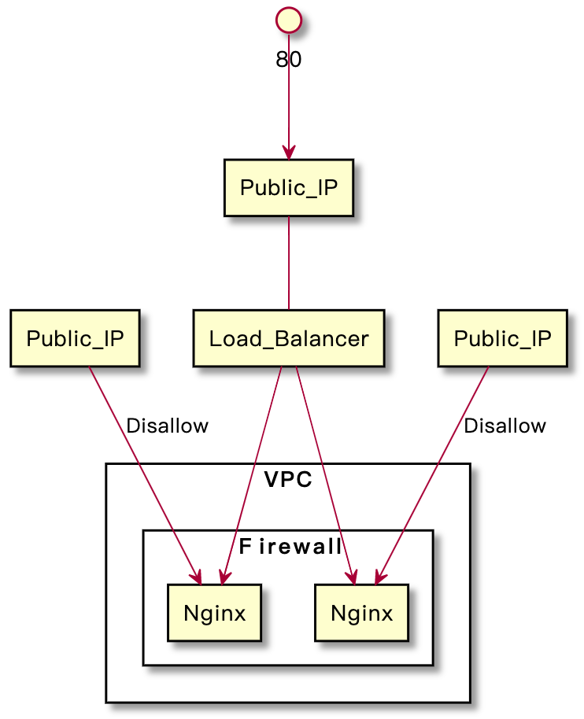
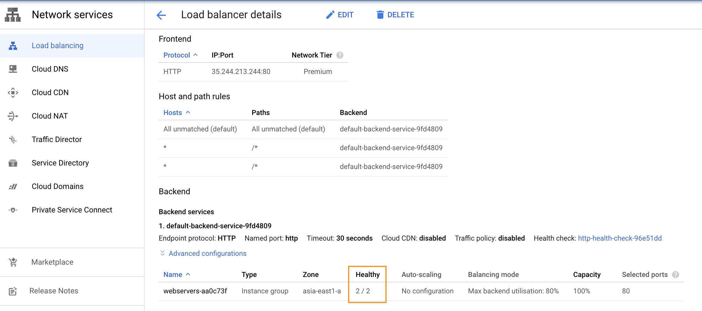
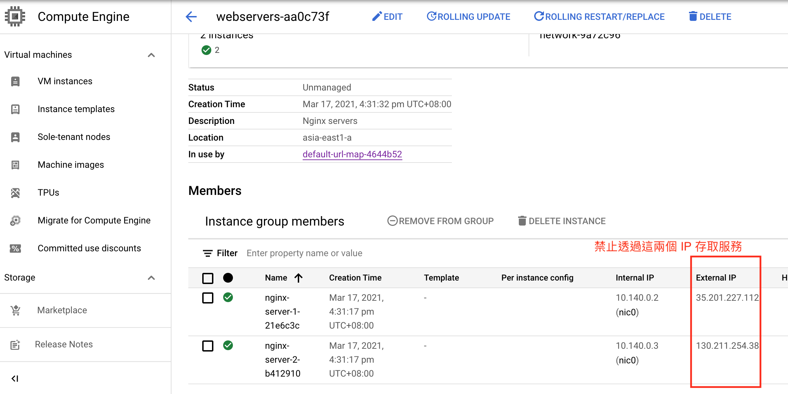

### 注意事項
* 範例皆以乾淨的環境運行，因此會在步驟中重新建立堆疊。若您的堆疊已含有其它資源，部署的結果可能會與範例結果有所差異，請先[刪除資源](#刪除資源)再開始我們的範例。

# 目標
1. 建立負載平衡器
2. 建立兩台 Nginx 後端伺服器
3. 僅允許透過負載平衡器的公共 IP 訪問 Nginx

   

# 步驟
1. 準備運行環境 `venv`
    ```bash
    $ python3 -m venv venv
    $ source venv/bin/activate
    $ pip3 install -r requirements.txt
    ```
2. 建立 `dev` 堆疊
    ```bash
    $ pulumi stack init dev
    ....
    Created stack 'dev'

    $ pulumi stack ls
    NAME  LAST UPDATE  RESOURCE COUNT  URL
    dev*  n/a          n/a             https://app.pulumi.com/<username>/loadbalancer/dev
    ```

3. 設定 GCP 專案
    ```bash
    $ pulumi config set gcp:project <your-gcp-project-name>
    ```
4. 執行單元測試
    ```bash
    $ python -m unittest -v
    test_server_tags (tests.test_backend_server.TestingNginx) ... ok
    test_firewall_ports (tests.test_firewall.TestingFirewall) ... ok
    test_source_ranges (tests.test_firewall.TestingFirewall) ... ok
    test_urlmap_host_rules (tests.test_lb.TestingLoadBalancer) ... ok
    test_urlmap_path_matchers (tests.test_lb.TestingLoadBalancer) ... ok

    ----------------------------------------------------------------------
    Ran 5 tests in 0.514s

    OK
    ```
5. 執行部署
    ```bash
    $ pulumi up
    Previewing update (dev)

    ...

        Type                                 Name                     Plan
    +   pulumi:pulumi:Stack                  loadbalancer-dev         create
    +   ├─ gcp:compute:GlobalAddress         load-balancer-address    create
    +   ├─ gcp:compute:HealthCheck           http-health-check        create
    +   ├─ gcp:compute:Network               network                  create
    +   ├─ gcp:compute:Instance              nginx-server-1           create
    +   ├─ gcp:compute:Instance              nginx-server-2           create
    +   ├─ gcp:compute:Firewall              firewall                 create
    +   ├─ gcp:compute:InstanceGroup         webservers               create
    +   ├─ gcp:compute:BackendService        default-backend-service  create
    +   ├─ gcp:compute:URLMap                default-url-map          create
    +   ├─ gcp:compute:TargetHttpProxy       target-http-proxy        create
    +   └─ gcp:compute:GlobalForwardingRule  forwarding-rule          create

    Resources:
        + 12 to create

    Do you want to perform this update? yes
    ...

        Type                                 Name                     Status
    +   pulumi:pulumi:Stack                  loadbalancer-dev         created
    +   ├─ gcp:compute:GlobalAddress         load-balancer-address    created
    +   ├─ gcp:compute:Network               network                  created
    +   ├─ gcp:compute:HealthCheck           http-health-check        created
    +   ├─ gcp:compute:Instance              nginx-server-1           created
    +   ├─ gcp:compute:Instance              nginx-server-2           created
    +   ├─ gcp:compute:Firewall              firewall                 created
    +   ├─ gcp:compute:InstanceGroup         webservers               created
    +   ├─ gcp:compute:BackendService        default-backend-service  created
    +   ├─ gcp:compute:URLMap                default-url-map          created
    +   ├─ gcp:compute:TargetHttpProxy       target-http-proxy        created
    +   └─ gcp:compute:GlobalForwardingRule  forwarding-rule          created

    Outputs:
        load-balancer-ip: "<load-balancer-ip>"

    Resources:
        + 12 created

    Duration: 2m25s
    ```

# 結果
1. 後端機器為`健康(Healthy)`狀態
    
2. 訪問負載平衡氣的 Public IP 存取服務
    1. 訪問 http://`<load-balancer-ip>`:80
    2. 顯示 Nginx 畫面
3. 透過虛擬機機器的 Public IP 存取服務
    1. 透過 GCP 控制台查看虛擬機器的 Public IP
        
    2. 訪問 http://`<vm-ip>`:80
    3. 無法存取

# 刪除資源
1. 刪除資源
    ```bash
    $ pulumi destroy
    ```
2. 刪除 `dev` 堆疊
    ```bash
    $ pulumi stack rm dev
    ```
